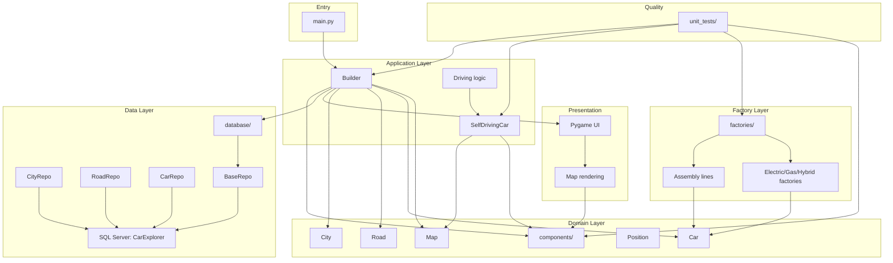
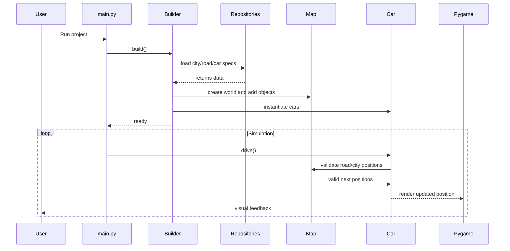

# Repository Architecture

This project is organized as a layered simulation application: the entry point creates a world, the builder assembles the map and vehicles, the services manage movement and logic, and the repositories supply world data.

## High-level system view



## Layer responsibilities

### 1. Entry and orchestration

- main.py starts the simulation and creates the game loop.
- Builder assembles the world by loading cities, roads, and cars into the map.
- The application creates a visual scene using Pygame and keeps the simulation moving.

### 2. Core domain model

The components folder contains the main objects of the simulated world:

- City
- Road
- Car
- map and shape representation
- Position and movement helpers
- vehicle behavior metadata

These are the main domain entities used throughout the system.

### 3. Services and behavior

The services folder holds the logic that drives the simulation forward:

- Builder coordinates world setup
- SelfDrivingCar handles route selection and motion decisions
- Driving contains movement/state handling used to animate and update car position

This is the behavior layer that transforms domain objects into active simulation logic.

### 4. Factories and assembly

The factories layer defines how cars and their parts are built:

- electric car factory
- gas car factory
- hybrid car factory
- battery and tank factories
- assembly lines that assemble specific models

This keeps creation logic separate from runtime simulation logic.

### 5. Data and repositories

The database layer contains repositories that communicate with SQL Server:

- BaseRepo handles the connection
- CityRepo, RoadRepo, and CarRepo fetch the data used to initialize the world

This keeps the app data-driven while preserving a clean separation between model and persistence.

### 6. Validation

The unit_tests folder exercises the key behavior of the project:

- road behavior
- map logic
- car logic
- driving behavior
- factory validation

These tests help verify the simulation continues to behave as expected.

## Runtime flow



## Folder map

```text
Cars/
├── main.py                      # application entry point
├── README.md                   # project overview and usage
├── ARCHITECTURE.md             # repository architecture overview
├── company/                    # company/domain business logic
├── components/                 # core simulation objects
├── services/                   # behavior and driving logic
├── factories/                  # assembly and construction logic
├── database/                   # repos and persistence access
├── unit_tests/                 # validation and regression tests
├── github_cmd/                 # operational scripts
├── LICENSE
└── test_helper.py
```

## Design summary

This repository follows a practical layered architecture:

- domain objects represent the simulation world
- services define how behavior unfolds
- factories abstract model creation
- repositories supply initial data from SQL Server
- the app layer coordinates the runtime loop and UI

That separation makes the project easy to trace from startup to simulation behavior, while also making extension points clear for new car types, maps, and logic.
