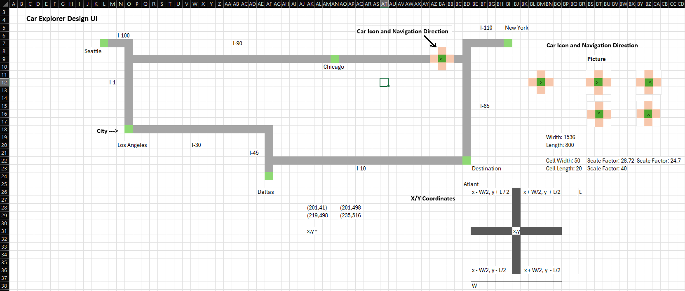
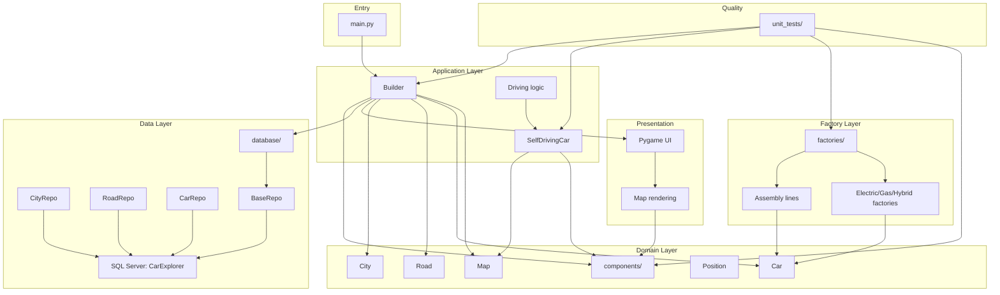
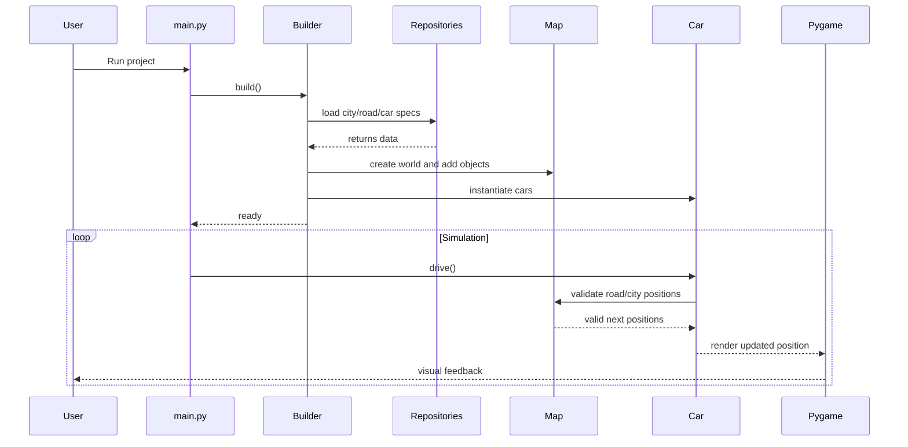

# Self-Driving Cars

Welcome to Self-Driving Cars — a hands‑on Python simulation built to explore city navigation, autonomous car behavior, and clean architectural patterns. It’s a practical example of how components, services, factories, and tests can work together to drive a small but expressive game‑style system.

I’m a recent college graduate looking for a job, and this project is one of the personal projects I’ve been building to share with employers. It offers a look at the kind of work I’m capable of, and I hope it helps demonstrate my skills, problem-solving approach, and motivation. I encourage employers and collaborators to explore the code and see what I can bring to a team.

## What this project does

The application creates a map-based simulation where cars travel through a city environment, using modular components to organize the world, movement rules, and vehicle behavior. The project includes:

- car and city entities
- game map and route logic
- service-based driving behavior
- factory patterns for building vehicles and related components
- unit tests to help validate behavior
- a simple Pygame-based visual demo

## Getting started

### Prerequisites

- Python 3
- Pygame installed in your environment

If needed, install the dependency with:

```bash
pip install pygame
```

### Run the project

From the project root, start the app with:

```bash
python -m main
```

This launches the simulation and shows the map-driven car behavior in action.

### Run a sample test

You can also run one of the project’s unit tests to get a feel for the codebase and test structure:

```bash
python -m unit_tests.components.road_unit_test
```

## Documentation assets

### UI design



### Architecture





## Project structure

A quick way to explore the code is to start with the main folders:

- `components/` — core game objects like cars, roads, cities, positions, and map elements
- `services/` — driving logic and shared helper functionality
- `factories/` — creation logic for building different car types and parts
- `database/` — repository and data-access code
- `docs/` — project documentation and visual assets
- `unit_tests/` — test examples for validating behavior
- `main.py` — the entry point for the demo

## A good way to explore

If you’d like to continue digging in, a natural order is:

1. Read `main.py` to see how the app is assembled
2. Browse the classes in `components/` to understand the world model
3. Review the driving logic in `services/` to see how movement is implemented
4. Look at the factory code in `factories/` to understand how objects are created
5. Check the unit tests in `unit_tests/` to understand expected behavior

## Why this project is interesting

This project blends game design, architecture, and software engineering in a compact codebase. It is a useful example if you want to study:

- modular application design
- object-oriented programming patterns
- reusable services and factories
- game loops and simulation updates
- how tests can guide implementation

## Keep exploring

There is plenty to discover in this codebase, and each folder tells a different part of the story. The best way to learn is to run the app, inspect the components, and trace how the simulation moves from setup to execution.

If you are curious, start with the entry point and follow the path of a car through the project. You may be surprised by how many ideas are packed into a relatively small project.

Happy exploring!


